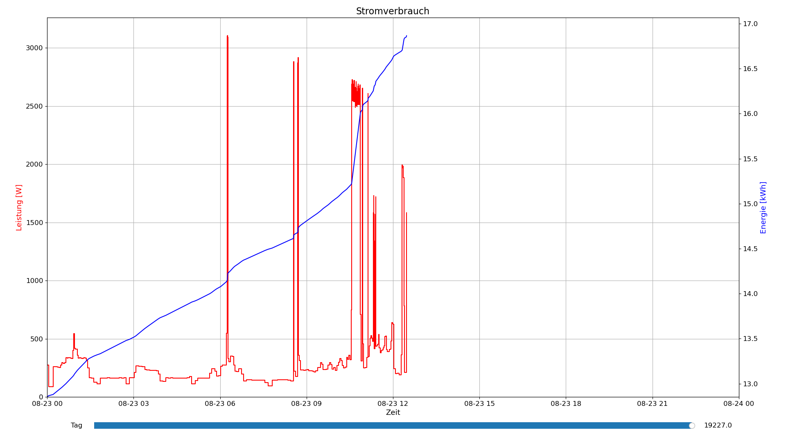
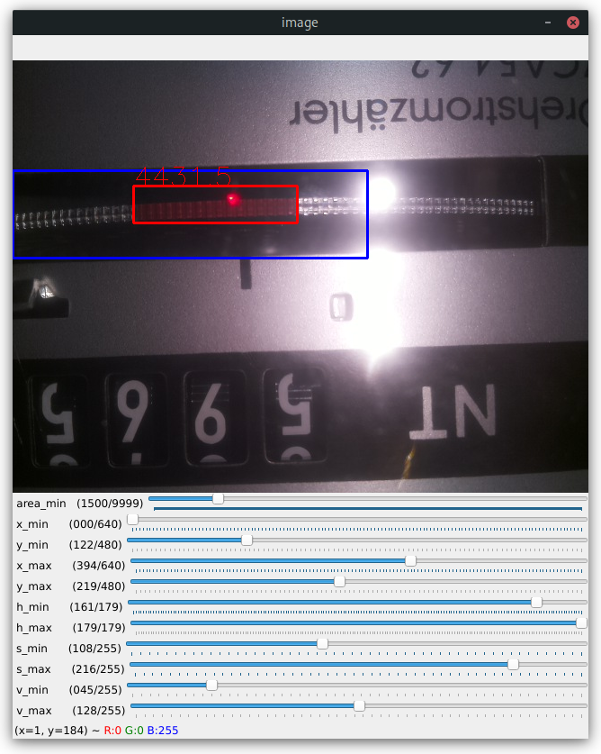

Was?
----
Wer noch keinen Smart Meter hat, aber dennoch den aktuellen Verbrauch auslesen will,
kann dies hiermit machen. Mit Home Assistant support über MQTT.

Die Dokumentation ist keine vollständige Schritt-für-Schritt-Anleitung, sollte aber nachvollziehbar sein.




Wie?
---
Mit einer an einem Raspberry Pi angeschlossen Kamera wird
das sich drehende Rad des Stromzählers gefilmt.
Mithilfe von OpenCV wird die rote Markierung, welche eine Umdrehung markiert,
erkannt und der Zeitpunkt mitgeschrieben. Daraus lässt sich der Energieverbrauch
und Leistung berechnen und mit matplotlib ploten.


Setup
-----

### Hardware

- Raspberry Pi: Ich verwende eine Model 3B. Ein Pi 2B sollte von der Leistung reichen, ist aber ohne WLAN.
  Ein Zero hat vermutlich zu wenig Leistung.
- Kamera: eine Raspberry Pi Camera. Ich verwende eine Model V1.3.
  Der Code lässt sich aber auch einfach auf eine USB-Webcam anpassen.
- Licht: Der Stromzähler sollte beleuchtet werden. Dazu reicht z.B.
  ein sehr kurzes Stück eins LED-Streifens, welches z.B. mit einem MT3608 betrieben werden kann.

### Software

- Raspberry Pi mit `Raspberry Pi OS 64bit` (bei 32Bit muss OpenCV kompiliert werden,
  ein Desktop sollte nicht zwingend erforderlich sein).
- `pip install opencv-contrib-python`
- [picamera2](https://github.com/raspberrypi/picamera2#installation)
- Auf dem System auf dem die Daten eingesehen werden sollen: `pip install matplotlib`

### Kamera

- Die Kamera sollte so ausgerichtet sein, dass das Drehrad einigermaßen mittig ist.
- Wahrscheinlich muss der Fokus angepasst werden.
- Die Status-LED kann mit `disable_camera_led=1` in `/boot/config.txt` deaktiviert werden.

### Kalibrieren

Um die richtigen Werte zum Erkennen der Markierung einzustellen,
muss ein Beispielfoto aufgenommen werden:
`libcamera-still --width 640 --height 480 -k -o calib.jpg -t 500000`.
Sobald die Markierung im Bild ist, kann mit `Enter` ein Bild gespeichert werden.

Mit `pyhton calib.py` kann das Bild geöffnet werden und verschiedene Parameter ausprobiert werden.
Am besten nimmt man sich für die HSV-Werte einen Color-Picker zur Hilfe.
Sobald das Ergebnis zufriedenstellend ist, kann das Fenster mit `q` geschlossen werden.
Die im Terminal ausgegeben Werte müssen in `log.py` kopiert werden



### Messen

Nun kann `log.py` auf dem Raspberry Pi ausgeführt werden. Die Messungen werden alle 15min in `log/log.csv` geschrieben.

Optional:

- Das Messen kann automatisch als Systemd Service gestartet werden.
  Dazu kann `smarter-meter.service` verwendet werden.
- Mit `smarter-meter_http.service` wird ein HTTP-Server gestartet, über den auf `log.csv`
  zugegriffen werden kann.

### Auswerten

- Falls `log.csv` über einen HTTP-Server zur Verfügung gestellt wird, muss die IP-Adresse in `plot.py` angepasst werden.
  Wenn auf eine lokale Datei zugegriffen werden soll, muss der Code gemäß den Kommentaren geändert werden.
- Falls eine Umdrehung des Stromzählers nicht 1/75kWh entspricht, muss in `plot.py` die Variable `TURN_INC` angepasst
  werden.

Nun ist alles fertig, sobald es genug Messungen gibt, können alle Werte mit `python plot.py`
eingesehen werden. Mit Mausrad und Pfeiltasten kann durch die Zeit navigiert werden.
Mit `F5` können die Werte aktualisiert werden.

### Home Assistant

Per MQTT kann die aktuelle Leistung an ein Broker geschickt werden und mit folgender Konfiguration in Home Assistant integriert werden:

```YAML
# Smarter-Meter
mqtt:
  sensor:
    - name: "Smarter-Meter Energy"
      state_topic: "smarter-meter/energy"
      device_class: "energy"
      state_class: "total_increasing"
      unit_of_measurement: "kWh"
    - name: "Smarter-Meter Power"
      state_topic: "smarter-meter/power"
      device_class: "power"
      state_class: "measurement"
      unit_of_measurement: "W"
```

In `log.py` muss dafür die IP des MQTT-Brokers angepasst und der gleiche Wert wie in `plot.csv` für `TURN_INC``eingetragen werden. 
